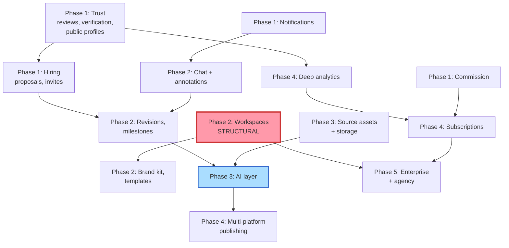

# Roadmap

Five phases. Each one is shippable on its own and leaves the product coherent — no phase depends on a later phase to make sense.

## Sequencing principles

Three rules decided the ordering, and they occasionally overrule "build the exciting thing first":

**Structural migrations go early, while they're cheap.** The `workspaces` change (making a campaign belong to an organisation rather than a user) touches `campaigns.brand_id`, every RLS policy that reads it, and every table added afterward that references a brand. It gets more expensive every phase you defer it. It's in Phase 2 for exactly that reason — not because agencies are the Phase 2 priority, but because Phase 3–5 add eleven tables that would otherwise need repointing later.

**Trust before supply, supply before AI.** AI clip suggestions are worthless if brands don't believe the creators are real. Reviews, verification, and public profiles are the substrate the rest sits on.

**Revenue early, at low complexity.** Commission lands in Phase 1 because it's a computation change (see [`08-monetisation.md`](./08-monetisation.md)), not because monetisation is urgent. Taking 0% while you build for a year is a choice you can't retroactively undo with your early cohort.

---

## Phase 1 — Trust & Discovery

*Make the marketplace real. Today a brand cannot find a creator, and a creator cannot prove they're good.*

| Feature | Doc | Why now |
|---|---|---|
| Public clipper profiles | [01](./01-marketplace.md) | `/clippers` exists but is a flat list with no detail page. There is no shareable creator URL — creators can't market themselves, so they don't recruit each other. |
| Discovery: search, categories, filters | [01](./01-marketplace.md) | `clipper_profiles.categories[]` and `style_tags[]` already exist and are unqueried. |
| Verification badges | [01](./01-marketplace.md) | Surfacing `youtube_connections.verification_method` in the UI. The data is already there and invisible. |
| Ratings & reviews | [01](./01-marketplace.md) | Gated on a released payout. The trust primitive everything else leans on. |
| Follows, saved creators, saved jobs | [01](./01-marketplace.md) | Cheap join tables, large retention effect. |
| Proposal system | [02](./02-hiring.md) | Extends `campaign_applications` (which already has `message` as a cover-letter seed) with bid, delivery estimate, and portfolio attachments. |
| Invite-only campaigns | [02](./02-hiring.md) | `campaigns.visibility` + `campaign_invites`. Unlocks repeat hiring, the single strongest retention lever in any marketplace. |
| Notifications & activity feed | [05](./05-collaboration.md) | Nothing currently tells a creator their application was approved. They have to guess and re-check. |
| Platform commission | [08](./08-monetisation.md) | Arithmetic change in the approve route. |
| Design system completion | [91](./91-design-system.md) | `lib/format.js`, `ThemeProvider`, `toast()`, `empty.jsx`, skeletons, `loading.js`/`error.js`. |
| Security & correctness fixes | [90](./90-architecture.md) | Brand-only route guards, the broken `campaigns` RLS policy, the missing `!user` guard on `/dashboard`. |

**Exit criteria:** a brand can find, evaluate, invite, and hire a creator they've never met, and the platform earns on it.

---

## Phase 2 — Delivery & Workspace

*Make the work itself happen on-platform. Today, everything between "approved" and "submitted" happens in someone's DMs.*

| Feature | Doc | Why now |
|---|---|---|
| **Workspaces migration** | [04](./04-workspace.md) | Structural, and cheapest right now. See the sequencing note above. |
| Team members & roles | [04](./04-workspace.md) | Falls out of workspaces almost for free once the migration lands. |
| Chat | [05](./05-collaboration.md) | The entire chat UI kit is already vendored and dead. Realtime is installed and unused. |
| Video annotations & timeline feedback | [05](./05-collaboration.md) | Timestamped comments on a submission. The single biggest reduction in revision round-trips. |
| Revisions & delivery tracking | [02](./02-hiring.md) | `campaign_submissions` is currently one-shot with no revision concept. |
| Milestones & contracts | [02](./02-hiring.md) | Multi-payout campaigns. Extends `campaign_payouts` with a milestone FK. |
| Brand kit & asset library | [04](./04-workspace.md) | `brand_profiles.font_name`/`color_code` already exist as a seed. |
| Approval workflow | [04](./04-workspace.md) | Multi-approver sign-off, required once teams exist. |
| Campaign templates | [04](./04-workspace.md) | Repeat campaign creation drops from minutes to one click. |

**Exit criteria:** a five-person marketing team runs a campaign end to end without leaving Clipper.

---

## Phase 3 — The AI Layer

*The differentiator. Everything before this was table stakes with better plumbing.*

| Feature | Doc |
|---|---|
| Source asset upload & processing pipeline | [03](./03-ai.md) |
| AI highlight detection → auto-generated campaign briefs | [03](./03-ai.md) |
| Viral score & AI quality score | [03](./03-ai.md) |
| Hook, caption, subtitle generation | [03](./03-ai.md) |
| Thumbnail suggestions | [03](./03-ai.md) |
| Brand voice | [03](./03-ai.md) |
| Auto hashtags & editing suggestions | [03](./03-ai.md) |
| AI credits ledger | [08](./08-monetisation.md) |

This is the first phase requiring genuinely new infrastructure: an AI SDK, a media processing pipeline, object storage beyond the single `avatars` bucket, and a job queue. Budget accordingly — it is not a UI phase.

**Exit criteria:** a brand uploads a podcast episode and gets a fundable campaign with three suggested clips, without writing a brief.

---

## Phase 4 — Distribution & Intelligence

*Own the last mile. Payment for a clip that never gets posted is a bad product.*

| Feature | Doc |
|---|---|
| Multi-platform connections (Instagram, TikTok, LinkedIn, X, Facebook) | [06](./06-publishing.md) |
| Scheduling & auto-publish | [06](./06-publishing.md) |
| Campaign ROI, reach, engagement, revenue analytics | [07](./07-analytics.md) |
| Leaderboards | [07](./07-analytics.md) |
| AI recommendations | [07](./07-analytics.md) |
| Subscription plans | [08](./08-monetisation.md) |

Generalising `youtube_connections` into `social_connections` is the load-bearing change here, and it interacts with the verification tiers — see the open decision in [`06-publishing.md`](./06-publishing.md).

**Exit criteria:** a clip goes from AI suggestion to published on four platforms with attributed performance data, inside Clipper.

---

## Phase 5 — Scale & Enterprise

*Sell to the accounts that pay real money.*

| Feature | Doc |
|---|---|
| Enterprise tier: SSO, audit logs, custom contracts | [08](./08-monetisation.md) |
| Agency tier: multi-client workspaces, white-label | [08](./08-monetisation.md) |
| Featured creators & featured campaigns | [08](./08-monetisation.md) |
| Marketplace liquidity levers | [92](./92-business.md) |
| Mobile app | [92](./92-business.md) |

**Exit criteria:** an agency manages twelve client brands with separate billing and isolated permissions.

---

## Dependency graph

The red node is the one with real blast radius. The blue node is the one that decides whether this is a business or a nicer Upwork.

---

## What is deliberately *not* being built

Saying no is part of the roadmap.

- **Hourly contracts and time tracking.** Upwork's core model, and a bad fit for clip work. Per-view and flat-fee cover the real cases; adding hourly invites disputes the platform can't adjudicate.
- **Long-form video editing in-browser.** Enormous scope, and the creators already own CapCut, Premiere, and Resolve. Clipper suggests edits; it doesn't perform them.
- **A generalised freelance marketplace.** Design, copywriting, and dev work are one schema change away and would destroy the positioning. The verified-performance trust model only works because the deliverable is measurable.
- **Crypto payouts, on-chain contracts, tokens.** No user is asking; Razorpay Route already solves the split-payment problem in the target market.
- **Own-brand video hosting/CDN.** Clips live on the platforms they're published to. Storing source assets is necessary for AI; becoming a video host is not.
