# Architecture

Sitemap, ERD, API architecture, component hierarchy, folder structure — for the system as it will exist after Phase 4. Current-state architecture is in [`../ARCHITECTURE.md`](../ARCHITECTURE.md).

## Correctness fixes to land in Phase 1

Found while reading the code. Independent of any feature, and all cheap.

| Issue | Location | Fix |
|---|---|---|
| **Broken RLS policy** — "Clippers can view campaigns they applied to" has a self-referential predicate (`a.campaign_id = a.id`) and never matches | `campaigns` policy, `supabase/migrations/20260725075602_remote_schema.sql:601` | Compare against `campaigns.id`. Rewrite as part of the visibility migration in [`02-hiring.md`](./02-hiring.md) |
| **Brand-only pages have no route guard** — `/brand-profile` and `/clippers` rely solely on nav-hiding | `src/app/(protected)/brand-profile/page.js`, `clippers/page.js` | Add `requireRole(supabase, user, "brand", "/dashboard")`. The helper exists and is used on every clipper-only page; there is currently no `role="brand"` call site anywhere |
| **Missing `!user` guard** — the only protected page without one | `src/app/(protected)/dashboard/page.jsx:8` | Add the standard `if (!user) redirect(...)`. Currently masked by the layout, but the page isn't independently defensive |
| ~~Stale legal copy~~ — **not stale after all** | `src/app/(legal)/clipper-terms/page.js:67` | "No real payouts are processed today" is **accurate**: Route isn't enabled, so payouts genuinely cannot run. Only "once a payment processor is integrated" is imprecise — the code exists, the product isn't provisioned. Revisit when Route is enabled |
| **Plaintext PII** — PAN, bank account, IFSC, and OAuth tokens in plain `text` columns despite `pgcrypto` being installed | `clipper_payout_accounts`, `youtube_connections` | Supabase Vault or column encryption. Gets worse with every platform added in Phase 4 |
| ~~**Stale docs**~~ — fixed 2026-08-01. `AGENTS.md`, `README.md`, `docs/supabase.md` and `docs/product/sql/README.md` all claimed `supabase/` didn't exist or held two migrations; it holds 21, plus `seed.sql` and the RLS suite | — | Done |

---

## Sitemap

```
PUBLIC
├── /                          Marketing home
├── /c/[handle]                Creator profile          ★ new, SEO surface
├── /discover                  Public creator directory ★ new
├── /campaigns/browse          Public campaign board    ★ new
├── /login
└── /privacy · /terms · /clipper-terms · /faq · /support

AUTHENTICATED — CREATOR
├── /dashboard                 Earnings, active work, invitations
├── /campaigns                 Browse + apply
├── /invitations               ★ new
├── /applications              ★ new — proposals, delivery state
├── /messages                  ★ new
├── /notifications             ★ new
├── /saved                     ★ new
├── /analytics                 Channel + campaign performance
├── /connectors                Platform connections
├── /clipper-profile           Profile + portfolio + handle
└── /payout-account            Razorpay KYC

AUTHENTICATED — BRAND (workspace-scoped)
├── /campaigns                 List, create, fund
│   └── /campaigns/[id]        Detail
│       ├── /applicants        Proposal comparison
│       ├── /submissions       Review + annotate      ★ new
│       ├── /milestones        ★ new
│       └── /analytics         ★ new
├── /discover                  Find + invite creators  ★ new
├── /messages                  ★ new
├── /notifications             ★ new
├── /saved                     ★ new
├── /studio                    ★ new — source assets, AI highlights (Phase 3)
├── /publishing                ★ new — schedule, calendar (Phase 4)
├── /insights                  ★ new — workspace analytics
└── /workspace
    ├── /settings              Name, plan
    ├── /members               Team + roles            ★ new
    ├── /brand-profile         Profile + brand kit
    ├── /assets                Asset library           ★ new
    ├── /templates             ★ new
    ├── /approvals             ★ new
    └── /billing               Subscription, invoices  ★ new

SUPER ADMIN
└── /admin                     Brands, clippers, campaigns, payouts, disputes, AI jobs, revenue
```

Every new protected route must be added to `PROTECTED_PATH_PREFIXES` in `src/lib/supabase/proxy.js` — it is not automatic, and the list currently has exact 1:1 coverage worth preserving.

The public group is new territory: today nothing but `/` and the legal pages is reachable without auth. `/c/[handle]` and `/discover` require an `anon` select policy, which no table currently grants.

---

## ERD

Existing tables in the first block, additions grouped by phase.

```mermaid
erDiagram
    auth_users ||--|| profiles : has
    auth_users ||--o| clipper_profiles : has
    auth_users ||--o| clipper_payout_accounts : has
    auth_users ||--o| youtube_connections : has
    auth_users ||--o{ youtube_videos : syncs

    workspaces ||--o{ workspace_members : has
    workspaces ||--|| brand_profiles : has
    workspaces ||--o{ campaigns : owns
    auth_users ||--o{ workspace_members : "belongs to"

    campaigns ||--o{ campaign_applications : receives
    campaigns ||--o{ campaign_invites : sends
    campaigns ||--o{ campaign_milestones : "split into"
    campaigns ||--o{ campaign_stats_daily : accumulates
    campaigns }o--o| campaign_templates : "created from"

    campaign_applications ||--o{ proposal_attachments : has
    campaign_applications ||--o{ campaign_submissions : produces
    campaign_applications ||--o| contracts : formalises
    campaign_applications ||--o| conversations : opens
    campaign_applications ||--o{ campaign_payouts : "pays via"
    campaign_applications ||--o{ reviews : "reviewed in"

    campaign_submissions ||--o{ annotations : "commented on"
    campaign_submissions ||--o{ revision_requests : "revised via"
    campaign_submissions ||--o{ published_posts : "published as"
    campaign_submissions }o--o| campaign_submissions : "revision of"

    campaign_milestones ||--o{ campaign_payouts : "paid per"

    conversations ||--o{ messages : contains
    conversations ||--o{ conversation_participants : has

    auth_users ||--o{ notifications : receives
    auth_users ||--o{ portfolio_items : owns
    auth_users ||--o{ saved_creators : saves
    auth_users ||--o{ follows : follows
    auth_users ||--o{ social_connections : connects

    workspaces ||--o{ source_assets : uploads
    source_assets ||--o{ highlight_candidates : yields
    highlight_candidates }o--o| campaigns : "becomes"
    workspaces ||--o| brand_voice : defines
    workspaces ||--o{ brand_assets : stores
    workspaces ||--o{ ai_jobs : runs
    workspaces ||--o| subscriptions : subscribes
    workspaces ||--o{ ai_credit_ledger : "meters via"

    social_connections ||--o{ published_posts : "publishes to"
```



| Phase | Tables added |
|---|---|
| 1 | `reviews`, `portfolio_items`, `saved_creators`, `saved_campaigns`, `follows`, `campaign_invites`, `proposal_attachments`, `notifications`, `notification_preferences`, `activity_events` |
| 2 | `workspaces`, `workspace_members`, `campaign_milestones`, `contracts`, `revision_requests`, `brand_assets`, `campaign_templates`, `approval_policies`, `approvals`, `conversations`, `conversation_participants`, `messages`, `annotations` |
| 3 | `source_assets`, `highlight_candidates`, `ai_jobs`, `brand_voice` |
| 4 | `social_connections`, `published_posts`, `campaign_stats_daily`, `subscriptions`, `plan_entitlements`, `ai_credit_ledger` |
| 5 | `promotions`, parent-organisation layer |

Views: `creator_stats`, `creator_leaderboard`, `platform_revenue`, plus a security-definer view exposing verification status without tokens.

---

## API architecture

### Principle: Server Components for reads, route handlers for writes

The codebase already follows this and it should stay. Pages fetch with `createClient()` from `src/lib/supabase/server.js`; route handlers exist only where a write needs validation, a third-party call, or the service-role client. Do not add REST endpoints to serve data a Server Component can query directly.

### Layering to introduce

Business logic currently lives inside route handlers. Two cases already force extraction:

- **Payout computation** — the milestone approve route needs the same arithmetic as the submission approve route. → `src/lib/payouts.js`
- **Notifications** — fired from apply, approve, release, invite, and message routes. → `src/lib/notifications.js`

```
src/lib/
├── supabase/          client, server, admin, proxy      (exists)
├── razorpay.js        SDK wrapper                       (exists)
├── youtube.js         → becomes platforms/youtube.js
├── payouts.js         ★ amount, fee, budget check       — extract in Phase 1
├── notifications.js   ★ notify() helper                 — Phase 1
├── format.js          ★ date, currency, number, rate    — Phase 1
├── storage.js         ★ upload, signed URLs             — Phase 2
├── workspaces.js      ★ requireWorkspaceRole()          — Phase 2
├── ai/                ★ provider, jobs, prompts         — Phase 3
└── platforms/         ★ per-platform adapters           — Phase 4
```

`format.js` is the highest-value-per-line change in the entire roadmap: it removes `formatDate` duplicated across 6 files, `formatRate` across 4, `formatNumber` across 2, and roughly 9 inline `Intl` call sites — and resolves the `en-IN` / `en-US` inconsistency in one place.

### Route conventions

Established by the existing payment routes and worth codifying:

1. Authenticate with the RLS-scoped client.
2. Verify ownership on that client — never the admin client.
3. Only then switch to `createAdminClient()`, and only for the specific cross-user reads or writes needed.
4. Return typed JSON errors with real status codes.

Rule 2 is what makes the service-role client safe. Every existing payment route follows it; every new one must.

### Third-party call surface

| Concern | Today | After Phase 4 |
|---|---|---|
| Payments | Razorpay Route | + Razorpay Subscriptions |
| Video data | YouTube Data + Analytics | + 5 platform APIs |
| AI | none | Provider via gateway |
| Email | Supabase Auth only | Transactional provider |
| Storage | Supabase `avatars` | + `brand-assets`, `source-assets`, `attachments` |
| Scheduling | none | Vercel Cron |

Every one of these needs the retry, timeout, and idempotency treatment the Razorpay webhook already demonstrates (raw-body HMAC verification, `.neq()` idempotency guard). That handler is the reference implementation.

---

## Component hierarchy

```
app/layout.js
├── ThemeProvider          ★ missing today — next-themes installed, no provider
├── TooltipProvider        (exists)
└── Toaster                ★ move to root; currently only in (protected)

(protected)/layout.js
└── SidebarProvider
    ├── AppSidebar
    │   ├── WorkspaceSwitcher   ★ Phase 2
    │   ├── NavMain             (role-branched, exists)
    │   └── NavUser
    ├── SiteHeader
    │   ├── Breadcrumbs
    │   ├── CommandPalette      ★ ui/command.jsx — vendored, unused
    │   └── NotificationBell    ★ Phase 1
    └── SidebarInset → page
```

**Component conventions to preserve.** Server Components fetch and pass props down; Client Components hold interaction state only. `/admin` is the reference — it runs 9 parallel service-role queries server-side, joins in memory, and passes finished arrays to table components that are `"use client"` purely for sheet-open state.

**Conventions to establish**, because there is no precedent and whatever ships first becomes the standard:

- **Data-fetching hooks.** There are none. Realtime chat forces the first one — `src/hooks/useRealtimeChannel.js`.
- **Tables.** `@tanstack/react-table` is used in exactly one file (`video-analytics-table.jsx`); five other tables are hand-rolled. Converge new tables on the tanstack pattern.
- **Formatters.** Currently duplicated per file. `lib/format.js`.
- **Empty, loading, error states.** See [`91-design-system.md`](./91-design-system.md).

---

## Folder structure

```
src/
├── app/
│   ├── (app)/              public marketing
│   ├── (public)/       ★   /c/[handle], /discover, /campaigns/browse
│   ├── (protected)/        authenticated shell
│   │   ├── workspace/  ★   settings, members, assets, templates, billing
│   │   ├── studio/     ★   Phase 3
│   │   └── publishing/ ★   Phase 4
│   ├── (legal)/
│   ├── admin/
│   └── api/
│       ├── payments/       (exists)
│       ├── connectors/     → connectors/[platform]/
│       ├── campaigns/  ★   invites, milestones, apply
│       ├── reviews/    ★
│       ├── conversations/ ★
│       ├── notifications/ ★
│       ├── workspace/  ★
│       └── ai/         ★
├── components/
│   ├── ui/                 base-ui primitives — 16 of 18 currently unused
│   ├── campaign/       ★   regroup by feature as this grows past ~40 files
│   ├── creator/        ★
│   ├── workspace/      ★
│   ├── chat/           ★
│   └── ai/             ★
├── hooks/                  useIsMobile only; add realtime, workspace
└── lib/                    see API layering above
```

The `(public)` route group is new and load-bearing — it's how you get SEO without weakening the authenticated shell. Note that route group names never affect URLs, so `/c/[handle]` living in `(public)` costs nothing structurally.

Feature-grouping `components/` matters once the count passes roughly 40; below that, flat is fine and the current flat layout should be left alone.

---

## Scaling notes

Current architecture is sound to roughly 10k users. The pressure points, in the order they'll arrive:

1. **`/admin`'s 9 parallel queries with in-memory joins** — fine now, quadratic later. Move to materialized views before it becomes urgent.
2. **RLS policies with `exists()` subqueries** need indexes on every joined column. `campaign_applications(campaign_id)` and `workspace_members(user_id)` are the hot paths after Phase 2.
3. **`youtube_videos` grows unbounded** per creator with no retention policy.
4. **No caching anywhere** — no `use cache`, no ISR, no revalidation tags. Public creator profiles are the obvious first candidate and are read-heavy by design.
5. **Realtime connection limits** are per-plan on Supabase; chat at scale needs connection pooling strategy.
6. **AI job processing cannot run in route handlers** — a queue and worker is a Phase 3 prerequisite, not an optimisation.
